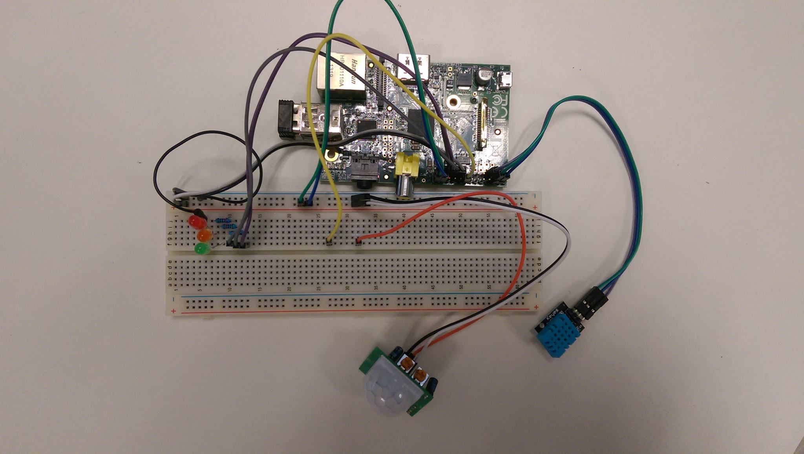
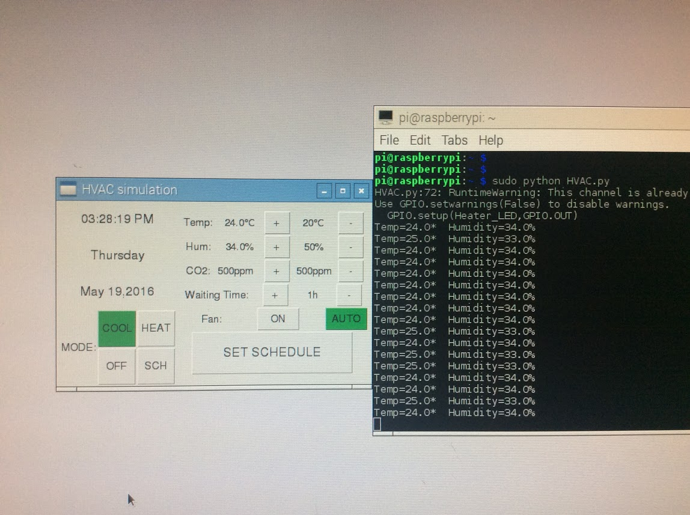

# Introduction
This repository is created for System Engineering Course project: HVAC control system. On this project we four team players work as a group to design a HAVC control system. This repository contain documents created by following [System Engineering Framwork](https://github.com/charlieshao5189/HVAC-control-system/blob/master/Systems%20engineering%20files/systemEngineeringProcess.png). 

content of folders:

*Project management files*: It containes agenda, minuts for meeting, project GANTT chart, timesheets of  team members.

*System Engineering files*: It contains all the documents of system engineering process: BRR, SRR, SDR, PDR, CDR, CONOPS. 

*Research*: It contains referece resources we collected for this project.

*Presentation*: PPT we made for finnal presentation.
# Prototype
I build a simple prototype for this project. It is implemnted by Python 2.7 on Raspberry Pi 2.

 
